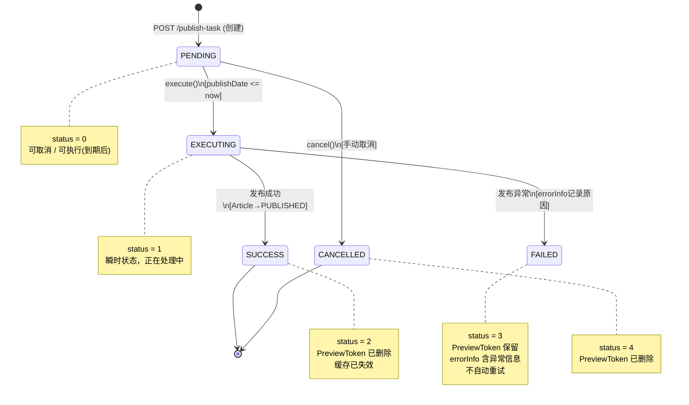
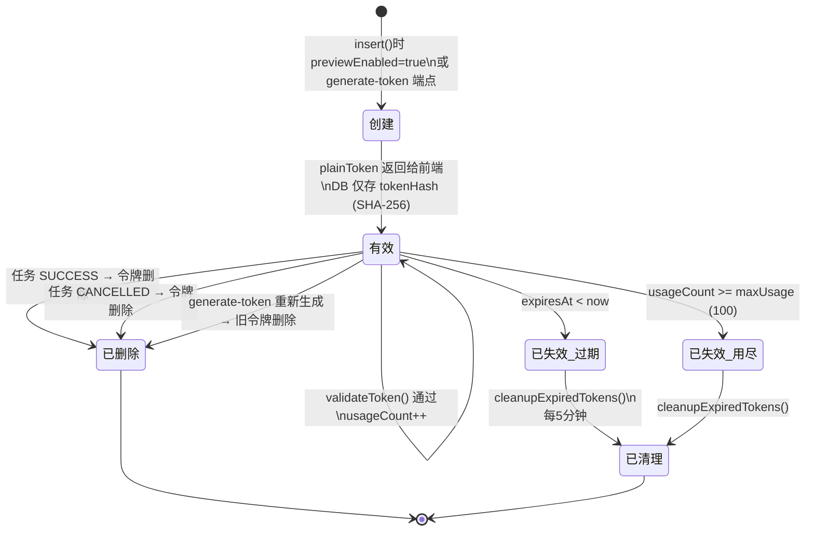
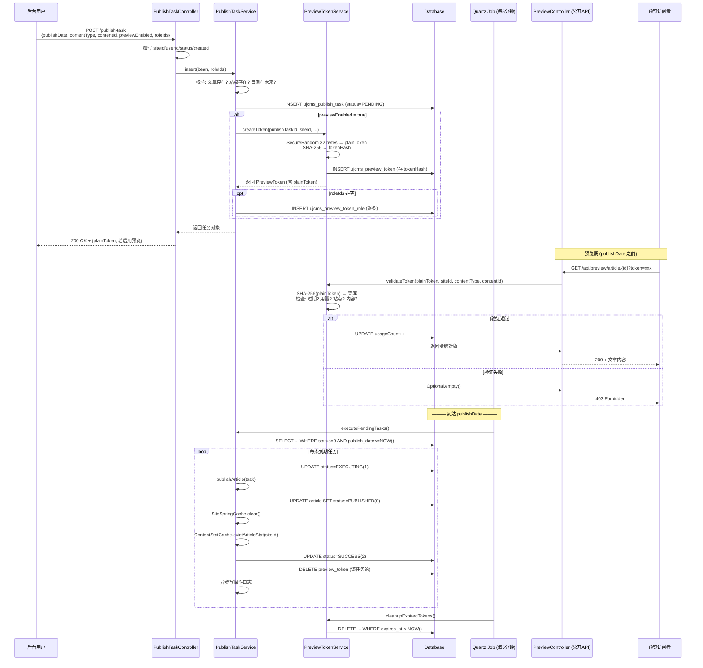

# 预约发布技术规格

> 适用版本: v11.x | 最后更新: 2026-06-13
> 本文档面向二开实施同事，不涉及 Java 源码修改。

---

## 目录

- [一、预约发布 PublishTask 端到端说明](#一预约发布-publishtask-端到端说明)
  - [1.1 涉及核心类一览](#11-涉及核心类一览)
  - [1.2 API 端点](#12-api-端点)
  - [1.3 创建任务流程](#13-创建任务流程)
  - [1.4 PreviewToken 预览期约束](#14-previewtoken-预览期约束)
  - [1.5 定时执行](#15-定时执行)
  - [1.6 单任务执行流程 execute()](#16-单任务执行流程-execute)
  - [1.7 成功 / 失败 / 取消 与 Article 状态的关系](#17-成功--失败--取消-与-article-状态的关系)
  - [1.8 状态机 (Mermaid)](#18-状态机-mermaid)
  - [1.9 PreviewToken 生命周期 (Mermaid)](#19-previewtoken-生命周期-mermaid)
  - [1.10 端到端时序 (Mermaid)](#110-端到端时序-mermaid)
- [二、跨站点隔离与 PreviewToken 安全模型](#二跨站点隔离与-previewtoken-安全模型)
  - [2.1 隔离维度](#21-隔离维度)
  - [2.2 测试用例覆盖 (PublishTaskCrossSiteTest)](#22-测试用例覆盖-publishtaskcrossitetest)
  - [2.3 二开注意事项](#23-二开注意事项)
- [三、发布后缓存失效触发点汇总](#三发布后缓存失效触发点汇总)
  - [3.1 缓存组件概览](#31-缓存组件概览)
  - [3.2 触发点明细](#32-触发点明细)
  - [3.3 二开扩展建议](#33-二开扩展建议)

---

## 一、预约发布 PublishTask 端到端说明

### 1.1 涉及核心类一览

| 类 | 路径 | 职责 |
|---|---|---|
| `PublishTaskController` | `core/web/backendapi/PublishTaskController.java` | 后台 REST API，CRUD + 取消 + 令牌再生 |
| `PublishTaskService` | `core/service/PublishTaskService.java` | 业务逻辑：插入、取消、执行、级联删除 |
| `PublishTask` | `core/domain/PublishTask.java` | 实体，含状态常量和领域判断方法 |
| `PreviewTokenService` | `core/service/PreviewTokenService.java` | 令牌创建、验证、清理 |
| `PreviewToken` | `core/domain/PreviewToken.java` | 令牌实体，含过期/用量/有效性判断 |
| `PreviewController` | `core/web/api/PreviewController.java` | 公开预览 API（无需登录，凭 token 访问） |
| `ScheduleConfig` | `core/ScheduleConfig.java` | Quartz 定时任务注册 |
| `ContentStatCache` | `core/component/ContentStatCache.java` | 内容统计缓存，发布后需失效 |
| `SiteSpringCache` | `core/domain/cache/SiteSpringCache.java` | 站点级通用缓存 |

### 1.2 API 端点

基础路径: `{BACKEND_API}/core/publish-task`

| 方法 | 路径 | 权限 | 说明 |
|---|---|---|---|
| `GET /` | — | `publish_task:list` | 分页列表，自动按当前站点过滤 |
| `GET /{id}` | — | `publish_task:show` | 详情；自动加载关联的首个 `PreviewToken` |
| `POST /` | `?roleIds=1,2` | `publish_task:create` | 创建任务；`roleIds` 可选，用于限定预览角色 |
| `PUT /` | — | `publish_task:update` | 更新任务 |
| `DELETE /` | body: `[id1,id2]` | `publish_task:delete` | 批量删除 |
| `POST /{id}/cancel` | — | `publish_task:update` | 取消待执行任务 |
| `POST /{id}/generate-token` | — | `publish_task:update` | 删除旧令牌并重新生成 |

### 1.3 创建任务流程

**Controller 层** (`PublishTaskController.create()`):

1. 接收请求体 JSON，Spring 自动绑定到 `PublishTask` Bean。
2. **安全覆写**: 忽略客户端传入的 `siteId`、`userId`、`status`、`created`，改为服务端赋值：
   - `siteId` = `Contexts.getCurrentSiteId()`（当前登录站点）
   - `userId` = 当前认证用户 ID
3. 调用 `service.insert(bean, roleIds)`。

**Service 层** (`PublishTaskService.insert()`):

```
校验 ①: 若 contentType="article"，查 articleService.select(contentId)
         → 文章不存在则抛 Http404Exception
校验 ②: 查 siteService.select(targetSiteId)
         → 目标站点不存在则抛 Http404Exception
校验 ③: publishDate 非空且必须在未来
         → 否则抛 Http400Exception
```

校验通过后：
- 生成 Snowflake ID
- 强制 `status = STATUS_PENDING (0)`
- 设置 `created = OffsetDateTime.now()`
- 默认 `previewEnabled = false`，`previewExpireHours = 24`（如未传入）
- 插入 DB

**如果 `previewEnabled = true`**:
- 计算 `expiresAt = publishDate + previewExpireHours`
- 调用 `previewTokenService.createToken(...)` 生成令牌（maxUsage 固定 100）
- 若传入了 `roleIds`，逐条插入 `ujcms_preview_token_role` 关联表

### 1.4 PreviewToken 预览期约束

#### 令牌创建 (`PreviewTokenService.createToken()`)

1. `SecureRandom` 生成 32 字节随机数 → 64 字符 hex 明文令牌 (`plainToken`)
2. SHA-256 哈希 → 64 字符 hex `tokenHash`
3. DB 只存 `tokenHash`；`plainToken` 仅通过 API 响应返回一次，**不持久化**

#### 令牌验证 (`PreviewTokenService.validateToken()`)

公开预览 API (`GET /api/preview/article/{id}?token=xxx`) 调用此方法，校验顺序：

| 步骤 | 检查项 | 失败结果 |
|---|---|---|
| 1 | 对传入 plainToken 做 SHA-256，按 tokenHash 查库 | 未找到 → 拒绝 |
| 2 | `token.isExpired()` — `expiresAt < now` | 过期 → 拒绝 |
| 3 | `token.isUsageExhausted()` — `usageCount >= maxUsage` | 超限 → 拒绝 |
| 4 | `token.siteId != 请求的 siteId` | 跨站 → 拒绝 |
| 5 | `contentType` 或 `contentId` 不匹配 | 内容不符 → 拒绝 |
| 6 | 全部通过: `usageCount++`，持久化 | 返回令牌对象 |

验证失败统一抛 `Http403Exception`。

#### 令牌销毁时机

| 场景 | 触发位置 | 说明 |
|---|---|---|
| 任务执行**成功** | `PublishTaskService.execute()` | 文章已发布，预览无意义 |
| 任务**取消** | `PublishTaskService.cancel()` | 任务作废，令牌一并删除 |
| 令牌**过期清理** | `ScheduleConfig.PublishTaskExecutionJob` | 每 5 分钟执行 `cleanupExpiredTokens()` |
| 手动**重新生成** | `PublishTaskController.generateToken()` | 先删旧令牌再创建新令牌 |

### 1.5 定时执行

**调度器**: Quartz (`ScheduleConfig`)

- **Job**: `PublishTaskExecutionJob`（`QuartzJobBean` 子类）
- **Cron**: `0 0/5 * * * ?` — 每 5 分钟执行一次
- **集群安全**: Quartz 自带集群锁，同一时刻仅一台机器执行
- **执行内容**:
  1. `publishTaskService.executePendingTasks()` — 执行所有到期的待发布任务
  2. `previewTokenService.cleanupExpiredTokens()` — 清理过期令牌

**`executePendingTasks()`** 逻辑：
```
查询: status = PENDING(0) AND publish_date <= NOW()，按 publish_date 升序
遍历每条任务 → 调用 execute(task.getId())
单条失败不影响后续任务（异常被 catch 并记录日志）
```

> **二开提示**: 发布时间精度为 5 分钟。如需更高精度可调整 Cron 表达式，但要注意集群负载。

### 1.6 单任务执行流程 execute()

`PublishTaskService.execute(Long id)` 的完整步骤：

```
1. 查询任务 → 不存在则抛 Http404Exception
2. 检查 isExecutable()
   = isPending() && publishDate <= now
   → 不满足则抛 Http400Exception
3. 更新状态 → STATUS_EXECUTING (1)
4. try {
     4a. 若 articleType → 调用 publishArticle(task)
         → article.setStatus(Article.STATUS_PUBLISHED)  // 值为 0
         → article.adjustStatus()  // 根据上下线日期微调
         → articleService.update(article)
     4b. SiteSpringCache.me().clear()               // 清全站缓存
     4c. ContentStatCache.me().evictArticleStat(siteId)  // 清文章统计缓存
     4d. 更新状态 → STATUS_SUCCESS (2)
     4e. 删除关联 PreviewToken
     4f. 异步写入操作日志 (status=SUCCESS)
   } catch (Exception e) {
     4g. 更新状态 → STATUS_FAILED (3)，errorInfo = e.getMessage()
     4h. 异步写入操作日志 (status=FAILURE)
     4i. 重新抛出 Http400Exception
   }
```

**操作日志特征值**（可用于审计查询）:
- `module = "publish_task"`
- `name = "publish_task.execute"`
- `requestMethod = "SYSTEM"`
- `requestUrl = "scheduled://publish-task/{taskId}"`
- `ip = "127.0.0.1"`

### 1.7 成功 / 失败 / 取消 与 Article 状态的关系

| PublishTask 结局 | Article.status 变化 | PreviewToken | 说明 |
|---|---|---|---|
| **SUCCESS (2)** | → `STATUS_PUBLISHED (0)`，再经 `adjustStatus()` 微调 | 全部删除 | `adjustStatus()` 可能将状态进一步调整为 `STATUS_READY`（上线日期在未来）或 `STATUS_OFFLINE`（下线日期已过） |
| **FAILED (3)** | 不变 | 保留（仍可预览） | `errorInfo` 记录异常信息，可在后台查看 |
| **CANCELLED (4)** | 不变 | 全部删除 | 仅 PENDING 状态可取消 |

### 1.8 状态机 (Mermaid)



### 1.9 PreviewToken 生命周期 (Mermaid)



### 1.10 端到端时序 (Mermaid)



---

## 二、跨站点隔离与 PreviewToken 安全模型

### 2.1 隔离维度

系统对预约发布实施**三层隔离**：

| 层级 | 隔离点 | 实现方式 |
|---|---|---|
| **任务隔离** | `siteId` | Controller 强制写入当前站点 ID，列表查询按 `siteId` 过滤；`show`/`delete`/`cancel` 均调用 `ValidUtils.dataInSite()` 校验归属 |
| **令牌隔离** | `siteId` + `contentType` + `contentId` | `validateToken()` 逐字段比对，任一不匹配即拒绝 |
| **角色隔离** | `roleIds` | 通过 `ujcms_preview_token_role` 关联表限定可预览的角色范围 |

#### siteId vs targetSiteId

| 字段 | 含义 | 使用场景 |
|---|---|---|
| `siteId` | 任务**归属站点** — 谁创建的、在哪个站点后台可见 | 权限校验、列表过滤、令牌绑定 |
| `targetSiteId` | 发布**目标站点** — 内容最终发布到哪个站点 | 执行时通过 `siteService.select()` 确认目标站点存在 |

> 典型场景: 总站 (siteId=1) 编辑为子站 (targetSiteId=2) 预约发布一篇文章。令牌绑定在 siteId=1，子站无法使用该令牌预览。

### 2.2 测试用例覆盖 (PublishTaskCrossSiteTest)

测试位于 `src/test/java/com/ujcms/cms/core/service/PublishTaskCrossSiteTest.java`，使用 Mockito 隔离数据库层。定义常量 `SITE_A = 1L`、`SITE_B = 2L`。

| 测试方法 | 验证目标 | 预期行为 |
|---|---|---|
| `selectBySiteA_doesNotReturnSiteBTasks` | 任务列表站点隔离 | 以 siteId=A 查询，不返回 siteId=B 的任务 |
| `previewToken_siteIsolation_siteMismatchRejectsToken` | 令牌跨站拒绝 | 令牌绑定 SITE_A，用 SITE_B 验证 → `Optional.empty()` |
| `previewToken_siteIsolation_sameSiteAcceptsToken` | 同站令牌通过 | 令牌绑定 SITE_A，用 SITE_A 验证 → 通过且 `usageCount++` |
| `deleteCascade_removesTokensForTask` | 级联删除 | 删除任务时同步删除其所有令牌 |
| `pendingTasks_siteIsolation_taskExecutesWithOwnSiteContext` | 执行时站点上下文 | 任务在自己的 siteId 上下文中执行；文章不存在则走 FAILED 路径 |

#### 关键断言逻辑示例

**跨站令牌拒绝**:
```
创建令牌: siteId=SITE_A, contentType="article", contentId=100
验证调用: validateToken(plainToken, siteId=SITE_B, "article", 100)
断言: result.isEmpty() == true
原因: PreviewTokenService.validateToken() 第5步 siteId 不匹配
```

**级联删除**:
```
调用: publishTaskService.delete(TASK_ID)
验证: previewTokenMapper.deleteByPublishTaskId(TASK_ID) 被调用
确保: 不会留下孤立令牌记录
```

### 2.3 二开注意事项

1. **不要绕过 Controller 的 siteId 覆写**。如果自定义 API 直接调用 Service 层，务必手动设置 `bean.setSiteId()`，否则可能创建出无站点归属的任务。

2. **PreviewToken 与 PublishTask 必须同站点**。`createToken()` 使用的 `siteId` 来自 PublishTask，不要传入不同的站点 ID。

3. **roleIds 仅控制预览资格，不影响发布权限**。发布执行时不检查 roleIds，它们仅在 `validateToken()` 流程中有意义（若业务需要，需自行扩展校验逻辑）。

4. **targetSiteId 目前仅做存在性校验**。如需跨站发布的额外权限校验（如目标站点是否允许接收），需自行在 `insert()` 中扩展。

5. **User/Site 删除级联**: `PublishTaskService` 实现了 `UserDeleteListener` 和 `SiteDeleteListener`，用户或站点被删除时自动清理相关任务。二开新增的级联关系也应遵循此模式。

---

## 三、发布后缓存失效触发点汇总

### 3.1 缓存组件概览

| 缓存 | 类 | 缓存名 | TTL | 最大条目 | 说明 |
|---|---|---|---|---|---|
| **站点缓存** | `SiteSpringCache` | `siteSpringCache` | 10 分钟 | 50,000 | 通用站点级 K-V 缓存 |
| **内容统计缓存** | `ContentStatCache` | `contentStat` | 10 分钟 | 10,000 | 文章/用户统计数据缓存 |

两个缓存均通过 `ApplicationContextAware` 的 `me()` 静态方法获取 Spring 代理实例，以确保 `@CacheEvict` 注解生效。

### 3.2 触发点明细

#### 触发点 1: 预约发布执行成功

**位置**: `PublishTaskService.execute()` — 成功路径

| 操作 | 调用 | 粒度 |
|---|---|---|
| 清空站点缓存 | `SiteSpringCache.me().clear()` | 全量清空 (allEntries=true) |
| 失效文章统计 | `ContentStatCache.me().evictArticleStat(task.getSiteId())` | 按站点 ID 精准失效 (key=`"article"+siteId`) |

> 注意: 这里使用的是 `task.getSiteId()`（任务归属站点），不是 `targetSiteId`。如果二开场景中 siteId 和 targetSiteId 不同，可能需要额外失效目标站点的缓存。

#### 触发点 2: 定时状态更新

**位置**: `ScheduleConfig.UpdateArticleStatusJob.executeInternal()` — 每 10 分钟

当文章因上下线日期自动变更状态时:

| 操作 | 调用 | 粒度 |
|---|---|---|
| 清空站点缓存 | `SiteSpringCache.me().clear()` | 全量清空 |
| 清空统计缓存 | `ContentStatCache.me().clear()` | 全量清空 (allEntries=true) |

此 Job 处理的场景:
- 文章到达 `onlineDate` → 状态变为上线
- 文章到达 `offlineDate` → 状态变为下线
- 文章到达 `stickyDate` → 取消置顶

#### 触发点 3: 过期令牌清理

**位置**: `ScheduleConfig.PublishTaskExecutionJob.executeInternal()` — 每 5 分钟

| 操作 | 调用 | 说明 |
|---|---|---|
| 删除过期令牌 | `previewTokenService.cleanupExpiredTokens()` | 不涉及缓存失效，仅清理 DB |

#### 汇总表

```
┌──────────────────────────┬─────────────────────┬──────────────────────────┬──────────┐
│ 触发场景                 │ 频率                │ 缓存操作                 │ 粒度     │
├──────────────────────────┼─────────────────────┼──────────────────────────┼──────────┤
│ PublishTask 执行成功     │ 事件驱动 (到期执行) │ SiteSpringCache.clear()  │ 全量     │
│                          │                     │ ContentStatCache         │          │
│                          │                     │   .evictArticleStat()    │ 按站点   │
├──────────────────────────┼─────────────────────┼──────────────────────────┼──────────┤
│ 文章上下线状态自动变更   │ 每 10 分钟          │ SiteSpringCache.clear()  │ 全量     │
│                          │                     │ ContentStatCache.clear() │ 全量     │
├──────────────────────────┼─────────────────────┼──────────────────────────┼──────────┤
│ 浏览量刷盘               │ 每 1 分钟           │ 无缓存操作               │ —        │
├──────────────────────────┼─────────────────────┼──────────────────────────┼──────────┤
│ 浏览统计更新             │ 每 1 分钟 (:45)     │ 无缓存操作               │ —        │
├──────────────────────────┼─────────────────────┼──────────────────────────┼──────────┤
│ 过期令牌清理             │ 每 5 分钟           │ 无缓存操作               │ —        │
└──────────────────────────┴─────────────────────┴──────────────────────────┴──────────┘
```

### 3.3 二开扩展建议

1. **跨站发布缓存失效不完整**：当前 `execute()` 仅失效 `task.getSiteId()` 的缓存。若 `targetSiteId != siteId`，目标站点的前端页面可能短暂展示旧数据（最多等 TTL 10 分钟自然过期）。如需立即生效，可在 `execute()` 成功路径追加:
   ```java
   if (!task.getSiteId().equals(task.getTargetSiteId())) {
       ContentStatCache.me().evictArticleStat(task.getTargetSiteId());
   }
   ```

2. **自定义缓存扩展**：如果二开引入了新的缓存（如频道统计、标签云缓存等），应在 `execute()` 成功路径中同步失效，仿照 `evictArticleStat()` 的模式：
   - 使用 `@CacheEvict` 注解
   - 通过 `me()` 获取代理实例调用（直接 `this.xxx()` 不会触发 AOP）

3. **`me()` 模式说明**：`SiteSpringCache.me()` 和 `ContentStatCache.me()` 均通过 `ApplicationContextAware` 从容器获取自身代理。这是因为 Spring Cache 的 `@CacheEvict` 基于 AOP 代理，类内部直接调用自身方法不会经过代理，导致缓存注解不生效。二开新增缓存组件时务必遵循此模式。

4. **失败不清缓存**: 任务执行失败时不会触发任何缓存失效（因为文章状态实际未变更），这是正确行为。不要在 catch 块中添加缓存清理。

---

## 附录: 数据库表结构速查

### ujcms_publish_task

| 列名 | 类型 | 说明 |
|---|---|---|
| `id_` | BIGINT | Snowflake 主键 |
| `site_id_` | BIGINT | 归属站点 |
| `user_id_` | BIGINT | 创建用户 |
| `target_site_id_` | BIGINT | 目标发布站点 |
| `content_type_` | VARCHAR(20) | `"article"` 或 `"channel"` |
| `content_id_` | BIGINT | 内容 ID |
| `publish_date_` | TIMESTAMP | 预约发布时间 |
| `status_` | SMALLINT | 0=待执行, 1=执行中, 2=成功, 3=失败, 4=已取消 |
| `preview_enabled_` | BOOLEAN | 是否启用预览 |
| `preview_expire_hours_` | INT | 预览令牌有效时长 (小时)，默认 24 |
| `error_info_` | VARCHAR(500) | 失败时的异常信息 |
| `created_` | TIMESTAMP | 创建时间 |

### ujcms_preview_token

| 列名 | 类型 | 说明 |
|---|---|---|
| `id_` | BIGINT | Snowflake 主键 |
| `publish_task_id_` | BIGINT | 关联任务 ID |
| `token_hash_` | VARCHAR(64) | SHA-256 哈希值（明文不存库） |
| `site_id_` | BIGINT | 令牌绑定站点 |
| `content_type_` | VARCHAR(20) | 内容类型 |
| `content_id_` | BIGINT | 内容 ID |
| `expires_at_` | TIMESTAMP | 过期时间 |
| `max_usage_` | INT | 最大使用次数 |
| `usage_count_` | INT | 已使用次数 |
| `created_` | TIMESTAMP | 创建时间 |

### ujcms_preview_token_role

| 列名 | 类型 | 说明 |
|---|---|---|
| `preview_token_id_` | BIGINT | 令牌 ID |
| `role_id_` | BIGINT | 角色 ID |
