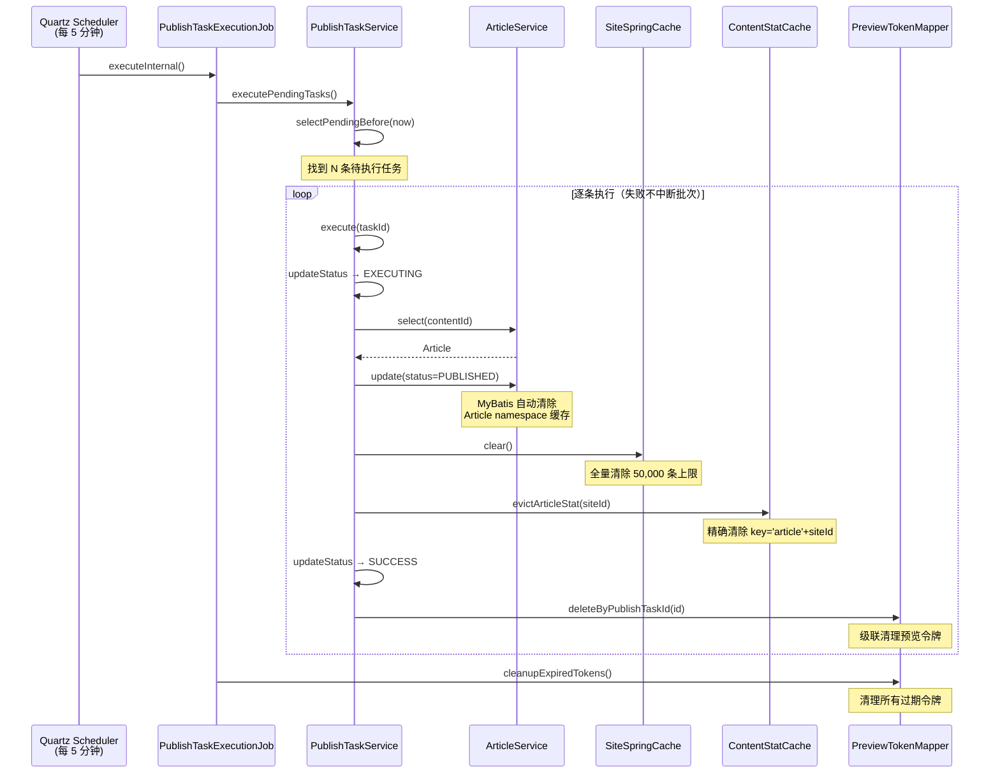

# 发布后缓存失效触发点汇总

> 预约发布执行成功后需要刷新哪些缓存、各缓存的作用域与失效策略。二开中如果新增了缓存层，需参照本文在 `PublishTaskService.execute()` 的成功路径中追加失效调用。

---

## 1. 缓存层概览

系统使用 **Caffeine** 作为 Spring Cache 的底层实现，共涉及以下缓存区域：

| 缓存名称 | 类 | 用途 | 过期策略 | 最大条目 |
|---|---|---|---|---|
| `siteSpringCache` | `SiteSpringCache` | MyBatis 二级缓存（站点级数据：Site、Channel、Article 等） | 写入后 10 分钟 | 50,000 |
| `contentStat` | `ContentStatCache` | 内容统计数据（文章数、栏目数、用户数、附件数） | 写入后 10 分钟 | 10,000 |
| `globalSpringCache` | `GlobalSpringCache` | MyBatis 二级缓存（全局级数据：Config 等） | — | — |
| `groupSpringCache` | `GroupSpringCache` | MyBatis 二级缓存（用户组级数据） | — | — |

---

## 2. 预约发布成功时的缓存失效

### 2.1 触发代码位置

`PublishTaskService.execute()` 在发布成功后、标记 `STATUS_SUCCESS` 前执行：

```java
// 刷新站点缓存
SiteSpringCache.me().clear();                    // ← 清除全部站点缓存
// 刷新内容统计缓存
ContentStatCache.me().evictArticleStat(task.getSiteId());  // ← 仅清除该站点的文章统计
```

### 2.2 具体失效行为

| 调用 | 失效范围 | 失效的缓存 Key |
|---|---|---|
| `SiteSpringCache.me().clear()` | **全局**——所有站点的所有 MyBatis 二级缓存条目 | `allEntries = true` |
| `ContentStatCache.me().evictArticleStat(siteId)` | **精确**——仅该站点的文章统计 | `'article' + siteId` |

### 2.3 为什么 SiteSpringCache 用 clear() 而非精确失效

`SiteSpringCache` 是 MyBatis 二级缓存的包装层，缓存 Key 由 MyBatis 自动生成（包含 SQL + 参数哈希），无法在业务层精确定位哪些 Key 对应被修改的 Article。因此采用**全量清除**，依赖下次查询时自然回填。

### 2.4 为什么 ContentStatCache 可以精确失效

`ContentStatCache` 的 Key 是业务层显式定义的（`'article' + siteId`），因此可以按站点精确清除，不影响其他站点或其他维度（channel / user / attachment）的统计缓存。

---

## 3. ContentStatCache 缓存条目明细

| 方法 | 缓存 Key | 数据内容 | 失效方式 |
|---|---|---|---|
| `articleStat(siteId)` | `'article' + siteId` | 文章总数 + 近 7 天新增数 | `evictArticleStat(siteId)` 精确失效 |
| `channelStat(siteId)` | `'channel' + siteId` | 栏目总数 + 近 7 天新增数 | 仅 `clear()` 全量清除 |
| `userStat()` | `'user'` | 用户总数 + 近 7 天新增数 | 仅 `clear()` 全量清除 |
| `attachmentStat(siteId)` | `'attachment' + siteId` | 附件总数 + 近 7 天新增数 | 仅 `clear()` 全量清除 |
| `clear()` | — | 以上全部 | `@CacheEvict(allEntries = true)` |

> **注意**：预约发布成功后**只清除了文章统计**，栏目 / 用户 / 附件统计不受影响。这是合理的——发布文章只影响文章计数。

---

## 4. 其他触发缓存失效的场景

以下场景也会触发相同的缓存清除操作，二开时需注意避免与预约发布产生冲突或重复失效：

### 4.1 UpdateArticleStatusJob（上下线状态定时任务）

```java
// ScheduleConfig.UpdateArticleStatusJob.executeInternal()
List<Article> stickyArticles = articleService.listAndUpdateStickyDate();
List<Article> onlineArticles = articleService.listAndUpdateOnlineStatus();
List<Article> offlineArticles = articleService.listAndUpdateOfflineStatus();
// ...
if (!articles.isEmpty()) {
    SiteSpringCache.me().clear();      // 全量清站点缓存
    ContentStatCache.me().clear();     // 全量清内容统计（注意：是 clear() 不是 evictArticleStat()）
}
```

| 对比项 | PublishTaskService.execute() | UpdateArticleStatusJob |
|---|---|---|
| SiteSpringCache | `clear()` 全量 | `clear()` 全量 |
| ContentStatCache | `evictArticleStat(siteId)` 精确 | `clear()` 全量 |
| 触发频率 | 每次任务执行成功时 | 定时任务，有变更文章时 |
| 影响范围 | 仅文章统计 | 全部统计维度 |

### 4.2 常规文章操作

`ArticleService` 本身**不直接**调用缓存失效方法。文章的新增、修改、删除操作依赖以下机制保持缓存一致性：

- **MyBatis 二级缓存**：`SiteCache`（`SiteSpringCache` 的 MyBatis Cache 适配器）在 Mapper 层自动管理。当同一 namespace 下发生写操作时，MyBatis 会自动清除该 namespace 的二级缓存。
- **ContentStatCache**：仅在定时任务（`UpdateArticleStatusJob`）和预约发布（`PublishTaskService.execute()`）中显式失效。日常 CRUD 操作**不会**触发 `ContentStatCache` 失效，依赖 10 分钟 TTL 自然过期。

---

## 5. 缓存失效时序图



---

## 6. 缓存失效的潜在问题与二开建议

### 6.1 批量发布时的缓存风暴

如果同一轮 `executePendingTasks()` 中有 100 条任务，`SiteSpringCache.me().clear()` 会被调用 100 次。每次全量清除后，下一个请求会触发大量缓存回填（cache stampede）。

**建议**：若业务场景中有大量并发预约发布，可考虑在 `executePendingTasks()` 批次结束后统一执行一次 `clear()`，而非每条任务都清。

### 6.2 ContentStatCache 精确失效的局限

`evictArticleStat(siteId)` 只清除了 `task.getSiteId()` 对应站点的缓存。如果 `targetSiteId != siteId`（跨站发布），目标站点的文章统计缓存**不会被清除**。

**建议**：跨站发布场景下，应同时失效两个站点的缓存：

```
ContentStatCache.me().evictArticleStat(task.getSiteId());
ContentStatCache.me().evictArticleStat(task.getTargetSiteId());
```

### 6.3 缓存 TTL 兜底

所有缓存均设有 TTL（`SiteSpringCache` 10 分钟，`ContentStatCache` 10 分钟），即使遗漏了显式失效，数据最多延迟 10 分钟自动更新。这为二开提供了安全网——新增的缓存失效调用即使有遗漏，也不会导致永久的数据不一致。

### 6.4 二开新增缓存的检查清单

| 检查项 | 说明 |
|---|---|
| 新缓存是否包含文章相关数据？ | 若是，需在 `PublishTaskService.execute()` 成功路径中添加失效调用 |
| 失效粒度？ | 优先精确失效（按 siteId），避免不必要的全量 `clear()` |
| 跨站场景？ | 若新缓存与 targetSiteId 相关，需同时失效源站和目标站 |
| TTL 设置？ | 即使有显式失效，也应设 TTL 作为兜底 |
