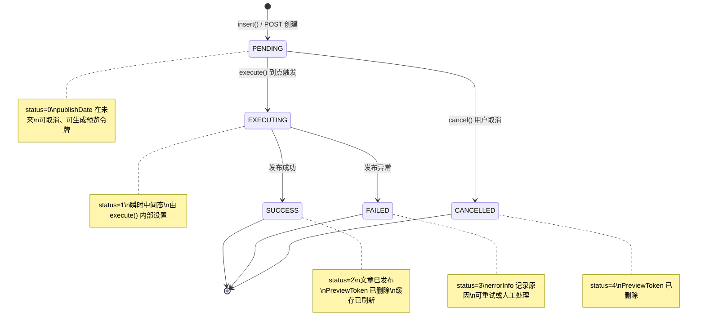
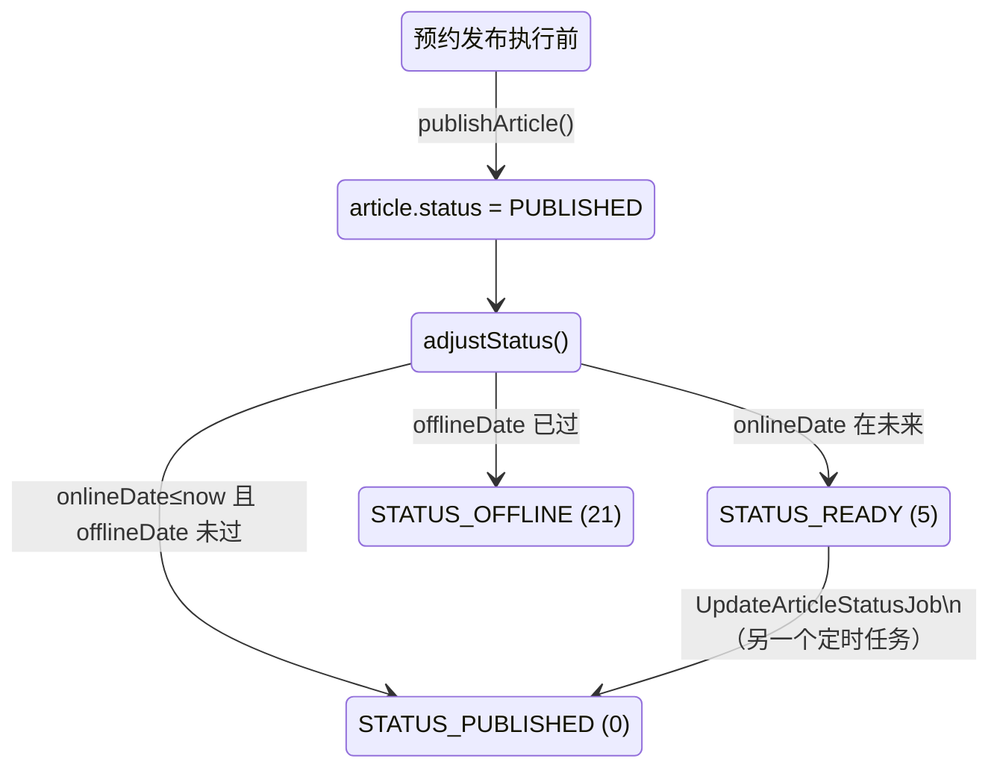

# 预约发布 PublishTask 端到端说明

> 面向二开实施同事的内部技术规格。基于源码 `PublishTaskController` / `PublishTaskService` / `PreviewTokenService` / `ScheduleConfig` 整理，不涉及 Java 源码修改。

---

## 1. 涉及的核心类与表

| 层 | 类 / 表 | 说明 |
|---|---|---|
| REST | `backendapi/PublishTaskController` | 后台 API 入口，路径前缀 `BACKEND_API + "/core/publish-task"` |
| Service | `PublishTaskService` | 任务生命周期管理：创建、取消、执行、批量执行 |
| Service | `PreviewTokenService` | 预览令牌的生成、验证、清理 |
| Entity | `PublishTask` → 表 `ujcms_publish_task` | 预约发布任务 |
| Entity | `PreviewToken` → 表 `preview_token` | 预览令牌（SHA-256 哈希存储） |
| Mapper | `PreviewTokenRoleMapper` | 令牌 ↔ 角色 多对多关联表 |
| Job | `ScheduleConfig.PublishTaskExecutionJob` | Quartz 定时任务，每 5 分钟触发 |
| Cache | `SiteSpringCache` / `ContentStatCache` | 发布成功后需要刷新的缓存 |

---

## 2. PublishTask 实体字段一览

| 字段 | 类型 | 说明 |
|---|---|---|
| `id` | `Long` (Snowflake) | 主键 |
| `siteId` | `Long` | **归属站点**（由服务端从 `Contexts` 写入，前端不可指定） |
| `userId` | `Long` | 创建人（同上，服务端注入） |
| `targetSiteId` | `Long` | 发布目标站点 |
| `contentType` | `String(20)` | `"article"` 或 `"channel"` |
| `contentId` | `Long` | 关联的文章 / 栏目 ID |
| `publishDate` | `OffsetDateTime` | 预约发布时间（必须在未来） |
| `status` | `Short` | 状态码（见下表） |
| `previewEnabled` | `Boolean` | 是否开启预览，默认 `false` |
| `previewExpireHours` | `Integer` | 预览令牌有效期（小时），默认 `24` |
| `errorInfo` | `String(500)` | 失败时的错误信息 |
| `created` | `OffsetDateTime` | 创建时间 |

### 2.1 状态常量

| 常量 | 值 | 含义 |
|---|---|---|
| `STATUS_PENDING` | `0` | 等待执行 |
| `STATUS_EXECUTING` | `1` | 正在执行（中间态） |
| `STATUS_SUCCESS` | `2` | 执行成功 |
| `STATUS_FAILED` | `3` | 执行失败（`errorInfo` 有值） |
| `STATUS_CANCELLED` | `4` | 已取消 |

### 2.2 辅助方法

- `isPending()` — `status == 0`
- `isExecutable()` — `isPending() && publishDate <= now()`
- `isArticleType()` — `contentType == "article"`

---

## 3. REST API 端点

| 方法 | 路径 | 权限 | 说明 |
|---|---|---|---|
| `GET` | `/` | `publish_task:list` | 分页列表，自动按当前站点 `siteId` 过滤 |
| `GET` | `/{id}` | `publish_task:show` | 查看详情，同时加载首个 PreviewToken 附加到响应 |
| `POST` | `/` | `publish_task:create` | 创建任务。`siteId`/`userId`/`status`/`created` 由服务端注入。可选 `@RequestParam roleIds` 限制预览角色 |
| `PUT` | `/` | `publish_task:update` | 更新任务，校验 `siteId` 归属 |
| `DELETE` | `/` | `publish_task:delete` | 批量删除（`@RequestBody List<Long> ids`），逐条校验 `siteId` |
| `POST` | `/{id}/cancel` | `publish_task:update` | 取消待发布任务，仅 `PENDING` 可取消 |
| `POST` | `/{id}/generate-token` | `publish_task:update` | 重新生成预览令牌（删旧建新），返回 `{token, expiresAt}` |

> **安全要点**：所有端点均通过 `ValidUtils.dataInSite()` 校验 `siteId` 与当前登录站点一致；`siteId` 和 `userId` **永远**从 `Contexts`（服务端上下文）获取，前端传入值会被覆盖。

---

## 4. 任务创建流程（insert）

```
前端 POST /publish-task
      │  body: { contentType, contentId, targetSiteId, publishDate,
      │          previewEnabled, previewExpireHours }
      │  param: ?roleIds=1,2,3 （可选）
      ▼
PublishTaskController.create()
      │  覆盖 siteId ← Contexts.getCurrentSiteId()
      │  覆盖 userId ← Contexts.getCurrentUserId()
      ▼
PublishTaskService.insert(task, roleIds)
      ├── 校验文章存在（contentType=article 时）
      ├── 校验目标站点 targetSiteId 存在
      ├── 校验 publishDate 在未来
      ├── 生成 Snowflake ID
      ├── status ← STATUS_PENDING (0)
      ├── 默认值：previewEnabled=false, previewExpireHours=24
      ├── mapper.insert(task)
      └── 若 previewEnabled == true：
            ├── expiresAt = publishDate + previewExpireHours
            ├── PreviewTokenService.createToken(...)
            │     ├── 生成 32 字节 SecureRandom → 64 字符 hex（plainToken）
            │     ├── SHA-256(plainToken) → tokenHash（入库）
            │     └── maxUsage = 100, usageCount = 0
            └── 若 roleIds 非空 → 逐条插入 preview_token_role 关联
```

**PreviewToken 创建时机**：仅在 `insert()` 且 `previewEnabled=true` 时创建一次。后续可通过 `generate-token` 端点重新生成（先删旧令牌再建新令牌）。

---

## 5. 预览令牌（PreviewToken）机制

### 5.1 实体字段

| 字段 | 类型 | 说明 |
|---|---|---|
| `id` | `Long` | 主键 |
| `publishTaskId` | `Long` | 关联的 PublishTask ID |
| `tokenHash` | `String(64)` | 明文的 SHA-256 哈希（**库中不存明文**） |
| `siteId` | `Long` | 站点 ID（用于跨站隔离校验） |
| `contentType` | `String(20)` | 内容类型 |
| `contentId` | `Long` | 内容 ID |
| `expiresAt` | `OffsetDateTime` | 过期时间 |
| `maxUsage` | `Integer` | 最大使用次数（默认 100） |
| `usageCount` | `Integer` | 已使用次数 |
| `plainToken` | `String` (`@JsonIgnore`) | 明文——仅在创建时可通过程序访问，**永远不会序列化到 JSON** |

### 5.2 验证逻辑（validateToken）

```
输入：plainToken, siteId, contentType, contentId
      │
      ▼
SHA-256(plainToken) → tokenHash → 查库
      │
      ├── 未找到 → empty
      ├── isExpired()（expiresAt < now）→ empty
      ├── isUsageExhausted()（usageCount >= maxUsage）→ empty
      ├── siteId 不匹配 → empty          ← 跨站隔离核心
      ├── contentType/contentId 不匹配 → empty
      └── 全部通过 → usageCount++ → 返回 token
```

### 5.3 预览期约束

| 约束 | 值 / 来源 |
|---|---|
| 令牌有效期 | `publishDate + previewExpireHours`（默认 24h 后过期） |
| 最大使用次数 | 硬编码 `100` |
| 站点隔离 | 验证时 `token.siteId` 必须等于请求上下文 `siteId` |
| 内容绑定 | 验证时 `contentType + contentId` 必须精确匹配 |
| 角色限制 | 通过 `preview_token_role` 表关联，仅指定角色的用户可使用（若未配置则不限制） |

### 5.4 令牌删除时机

| 场景 | 触发方式 |
|---|---|
| 任务执行成功 | `execute()` 成功后调用 `previewTokenMapper.deleteByPublishTaskId(id)` |
| 任务取消 | `cancel()` 调用 `previewTokenMapper.deleteByPublishTaskId(id)` |
| 任务删除 | `delete()` 级联删除 token + token_role |
| 重新生成 | `generate-token` 端点先删旧令牌再建新令牌 |
| 定时清理 | `PublishTaskExecutionJob` 每 5 分钟调用 `cleanupExpiredTokens()` 删除 `expiresAt < now` 的令牌 |

---

## 6. 任务执行流程

### 6.1 定时触发

```
ScheduleConfig.PublishTaskExecutionJob（Quartz，cron = "0 0/5 * * * ?"）
      │
      ├── PublishTaskService.executePendingTasks()
      │     ├── selectPendingBefore(now)
      │     │     SQL: WHERE status_ = 0 AND publish_date_ <= NOW()
      │     │          ORDER BY publish_date_ ASC
      │     └── for each task → execute(task.getId())
      │           捕获异常但不中断批次（一条失败不影响其他）
      │
      └── PreviewTokenService.cleanupExpiredTokens()
            SQL: DELETE FROM preview_token WHERE expiresAt < NOW()
```

> Quartz 集群安全：同一时刻仅一台机器执行。

### 6.2 单任务执行（execute）

```
execute(id)
      │
      ├── 加载任务，校验存在
      ├── isExecutable()？（pending && publishDate <= now）
      │     否 → 抛 Http400Exception
      │
      ├── status → STATUS_EXECUTING (1)
      │
      ├── 【文章类型】publishArticle(task)
      │     ├── 加载 Article
      │     ├── article.status ← STATUS_PUBLISHED (0)
      │     ├── article.adjustStatus()
      │     │     ├── onlineDate 在未来？→ status → STATUS_READY (5)
      │     │     ├── offlineDate 已过？ → status → STATUS_OFFLINE (21)
      │     │     └── 否则保持 STATUS_PUBLISHED (0)
      │     └── articleService.update(article)
      │
      ├── SiteSpringCache.me().clear()           ← 清站点缓存
      ├── ContentStatCache.me().evictArticleStat(siteId)  ← 清内容统计
      │
      ├── status → STATUS_SUCCESS (2)
      ├── 删除关联 PreviewToken
      └── 记录 OperationLog
      │
      └── 异常 → status → STATUS_FAILED (3) + errorInfo
                  记录 OperationLog（失败）
                  抛 Http400Exception
```

### 6.3 execute 与 Article.STATUS_PUBLISHED 的关系

`PublishTaskService.publishArticle()` 先将文章状态设为 `STATUS_PUBLISHED (0)`，随即调用 `article.adjustStatus()` 做二次判定：

| adjustStatus 输入 | onlineDate | offlineDate | 最终状态 |
|---|---|---|---|
| `STATUS_PUBLISHED` | 在未来 | — | `STATUS_READY (5)` — 等上线时间到 |
| `STATUS_PUBLISHED` | 已过 / null | 已过 | `STATUS_OFFLINE (21)` — 已下线 |
| `STATUS_PUBLISHED` | 已过 / null | 在未来 / null | `STATUS_PUBLISHED (0)` — 正常发布 |

> **二开注意**：预约发布执行后文章**不一定**变成 `STATUS_PUBLISHED`。若文章自身设置了未来的 `onlineDate`，它会先进入 `STATUS_READY`，由 `UpdateArticleStatusJob`（另一个定时任务）在上线时间到达时转为 `PUBLISHED`。

---

## 7. 取消流程

```
POST /{id}/cancel
      │
      ├── 加载任务，校验存在
      ├── isPending()？
      │     否 → 抛 "Can only cancel pending tasks"
      ├── status → STATUS_CANCELLED (4)
      └── 删除关联 PreviewToken
```

> 仅 `STATUS_PENDING (0)` 的任务可取消。`EXECUTING` / `SUCCESS` / `FAILED` 均不可。

---

## 8. 状态机



### 附：文章状态在发布后的流转



---

## 9. 级联删除与生命周期事件

| 事件 | 影响 |
|---|---|
| 删除 PublishTask | 级联删除 `preview_token_role` → `preview_token` → `publish_task` |
| 删除 User | `PublishTaskService.preUserDelete(userId)` 删除该用户所有任务（`deleteListenerOrder=100`） |
| 删除 Site | `PublishTaskService.preSiteDelete(siteId)` 删除该站点所有任务 |

---

## 10. 二开注意事项

1. **publishDate 精度**：Quartz 每 5 分钟轮询一次，实际执行时间可能比 `publishDate` 延迟最多 5 分钟。
2. **PreviewToken 明文**：仅在 `createToken()` / `generate-token` 时可获得明文，之后只能通过 `validateToken(plainToken, ...)` 验证，库中只存 SHA-256 哈希。
3. **`targetSiteId` vs `siteId`**：`siteId` 是任务归属站点（用于权限隔离），`targetSiteId` 是内容发布的实际目标站点，两者可以不同（跨站发布场景）。
4. **Article.adjustStatus()**：预约发布不保证文章最终为 `PUBLISHED`，需关注文章自身的 `onlineDate` / `offlineDate`。
5. **事务边界**：`execute()` 整体在 `@Transactional` 中，若发布文章失败，任务状态回滚后重新设为 `FAILED`（在 catch 块中单独 updateStatus）。
6. **generate-token 幂等性**：每次调用先删旧令牌再建新令牌，不会累积。
